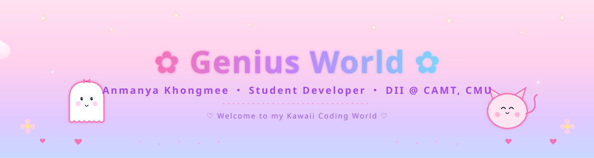

<!-- 🍑✨ Hi' GENIUS  — COZY KAWAII PROFILE ✨🍑 -->

<!-- ════════════════════════════════════════════════════════ -->
<!--          🌷 CUSTOM ANIMATED HEADER BANNER 🌷             -->
<!-- ════════════════════════════════════════════════════════ -->

<div align="center">



</div>

<br>

<!-- ════════════════════════════════════════════════════════ -->
<!--             ✨ TYPING ANIMATION + BADGES ✨              -->
<!-- ════════════════════════════════════════════════════════ -->

<div align="center">

<a href="https://github.com/ggnamy">
  
</a>

<br><br>


<br><br>


</div>

<br>

<!-- 🌈 ANIMATED ORANGE DIVIDER -->
<div align="center">
  
</div>

<br>

<!-- ════════════════════════════════════════════════════════ -->
<!--                  🌼 ABOUT ME 🌼                          -->
<!-- ════════════════════════════════════════════════════════ -->

<div align="center">

# 🌸 ✦ About Me ✦ 🌸

</div>

<table>
  <tr>
    <td width="55%" valign="top">

```yaml
  ──────────────────────────────
 ✿  G E N I U S   P R O F I L E  ✿
  ────────────────────────────── 

  🎀  Name      :  Anmanya Khongmee
  🍑  Nickname  :  Genius
  💻  Role      :  Student Developer
  🎓  Major     :  Digital Industry
                   Integration (DII)
  🏫  Faculty   :  CAMT
  🌼  School    :  Chiang Mai University
  ✨  Status    :  Learning & Growing
  ☕  Mood      :  Cozy coding vibes

 ────────────────────────────── 
```

### ☕ Hi, I'm Genius!

I'm a student at **CAMT, Chiang Mai University**, majoring in **Digital Industry Integration (DII)**.

I like making websites that feel warm, soft, and easy to use — the kind of stuff I'd actually want to use myself. Right now I'm spending most of my time on **web dev**, **UI design**, and trying to figure out how to make things look really pretty.

Outside of coding, I'm probably drinking coffee, taking photos, or thinking about my next little project. 🍂

<br>

> 🌷 *"Make it cute. Make it work. Make it yours."* 🌷

</td>
<td width="45%" align="center" valign="top">

<br>

### 🎀 What I'm Into

<br>


<br>


<br>

<br>

<br>


<br><br>


</td>
  </tr>
</table>

<!-- 🌈 ANIMATED RAINBOW DIVIDER -->
<div align="center">
  
</div>

<!-- ════════════════════════════════════════════════════════ -->
<!--             🍂 KAWAII DEVELOPER PROFILE 🍂               -->
<!-- ════════════════════════════════════════════════════════ -->

<div align="center">

# 🍂 ✦ My Vibe ✦ 🍂

<table>
  <tr>
    <td align="center" width="25%">
      
      <br>
      <h2>🎓</h2>
      <b>Student</b><br>
      <sub>DII @ CAMT, CMU</sub>
    </td>
    <td align="center" width="25%">
      
      <br>
      <h2>💻</h2>
      <b>Developer</b><br>
      <sub>Frontend lover</sub>
    </td>
    <td align="center" width="25%">
      
      <br>
      <h2>🎨</h2>
      <b>Designer</b><br>
      <sub>UI / UX enthusiast</sub>
    </td>
    <td align="center" width="25%">
      
      <br>
      <h2>🌱</h2>
      <b>Learner</b><br>
      <sub>Always growing</sub>
    </td>
  </tr>
</table>

</div>

<div align="center">
  
</div>

<!-- ════════════════════════════════════════════════════════ -->
<!--                  ☕ WHAT I'M UP TO ☕                    -->
<!-- ════════════════════════════════════════════════════════ -->

<div align="center">

# ☕ ✦ What I'm Up To ✦ ☕

<table>
  <tr>
    <td align="center" width="33%" valign="top">
      
      <h3>🌱 Currently Learning</h3>
      <br>
      <b>HTML · CSS · JavaScript</b><br>
      <b>React · Vite · Tailwind</b><br>
      <br>
      <sub>One line at a time 🍂</sub>
    </td>
    <td align="center" width="33%" valign="top">
      
      <h3>🎨 Mostly Into</h3>
      <br>
      <b>Web Development</b><br>
      <b>UI Design · Cozy themes</b><br>
      <br>
      <sub>Soft interfaces, happy users 🌷</sub>
    </td>
    <td align="center" width="33%" valign="top">
      
      <h3>🤝 Down For</h3>
      <br>
      <b>Web Collabs</b><br>
      <b>Student Projects</b><br>
      <br>
      <sub>Hit me up anytime 🍑</sub>
    </td>
  </tr>
</table>

<br>


</div>

<div align="center">
  
</div>

<!-- ════════════════════════════════════════════════════════ -->
<!--                  🍯 TECH STACK 🍯                        -->
<!-- ════════════════════════════════════════════════════════ -->

<div align="center">

# 🍯 ✦ My Tech Stack ✦ 🍯

<br>

### 🌼 Frontend

<a href="#"></a>

<br>


<br><br>

### 🎀 Tools & Design

<a href="#"></a>

<br>


<br><br>

<!-- ✨ ANIMATED TECH GIFS ✨ -->


</div>

<div align="center">
  
</div>

<!-- ════════════════════════════════════════════════════════ -->
<!--             🍂 LEARNING JOURNEY 🍂                       -->
<!-- ════════════════════════════════════════════════════════ -->

<div align="center">

# 🌻 ✦ Learning Journey ✦ 🌻

<br>

<table>
  <tr>
    <td align="center" width="20%">
      <h2>🌱</h2>
      <b>Step 01</b><br>
      <sub>HTML & CSS</sub><br>
      
    </td>
    <td align="center" width="20%">
      <h2>⚡</h2>
      <b>Step 02</b><br>
      <sub>JavaScript</sub><br>
      
    </td>
    <td align="center" width="20%">
      <h2>⚛️</h2>
      <b>Step 03</b><br>
      <sub>React</sub><br>
      
    </td>
    <td align="center" width="20%">
      <h2>🐙</h2>
      <b>Step 04</b><br>
      <sub>GitHub</sub><br>
      
    </td>
    <td align="center" width="20%">
      <h2>🚀</h2>
      <b>Step 05</b><br>
      <sub>Real Projects</sub><br>
      
    </td>
  </tr>
</table>

<br>


<br>

<br>

<br>

<br>


</div>

<div align="center">
  
</div>

<!-- ════════════════════════════════════════════════════════ -->
<!--            🍑 STUFF I LIKE TO BUILD 🍑                   -->
<!-- ════════════════════════════════════════════════════════ -->

<div align="center">

# 🍑 ✦ Stuff I Like to Build ✦ 🍑

<table>
  <tr>
    <td align="center" width="33%" valign="top">
      <h2>🌐</h2>
      <h3>Web Projects</h3>
      <sub>Clean, useful sites<br>that people actually enjoy</sub>
    </td>
    <td align="center" width="33%" valign="top">
      <h2>🎨</h2>
      <h3>UI Design</h3>
      <sub>Soft, friendly interfaces<br>with a cozy touch</sub>
    </td>
    <td align="center" width="33%" valign="top">
      <h2>📚</h2>
      <h3>Learning Bits</h3>
      <sub>Small experiments<br>and side practice</sub>
    </td>
  </tr>
</table>

</div>

<div align="center">
  
</div>

<!-- ════════════════════════════════════════════════════════ -->
<!--                🌞 CODING VIBES 🌞                        -->
<!-- ════════════════════════════════════════════════════════ -->

<div align="center">

# 🌞 ✦ Coding Vibes ✦ 🌞

<br>


<br>


<br><br>


<br>

> 🌻 *"Every line of code is a tiny step toward something cute."* 🌻

</div>

<div align="center">
  
</div>

<!-- ════════════════════════════════════════════════════════ -->
<!--                🍯 GITHUB STATS 🍯                        -->
<!-- ════════════════════════════════════════════════════════ -->

<div align="center">

# 📈 ✦ GitHub Activity ✦ 📈

<br>

<a href="https://github.com/ggnamy">
  
  
</a>

<br><br>

<a href="https://github.com/ggnamy">
  
</a>

<br><br>

### 🐍 Contribution Snake

<picture>
  <source media="(prefers-color-scheme: dark)" srcset="https://raw.githubusercontent.com/ggnamy/ggnamy/output/github-contribution-grid-snake-dark.svg" />
  <source media="(prefers-color-scheme: light)" srcset="https://raw.githubusercontent.com/ggnamy/ggnamy/output/github-contribution-grid-snake.svg" />
  
</picture>

<br><br>

<a href="https://github.com/ryo-ma/github-profile-trophy">
  
</a>

<br><br>


</div>

<div align="center">
  
</div>

<!-- ════════════════════════════════════════════════════════ -->
<!--            💭 DAILY INSPIRATION 💭                       -->
<!-- ════════════════════════════════════════════════════════ -->

<div align="center">

# 💭 ✦ Today's Vibe ✦ 💭

<br>

<a href="https://github.com/piyushsuthar/github-readme-quotes">
  
</a>

</div>

<div align="center">
  
</div>

<!-- ════════════════════════════════════════════════════════ -->
<!--                📬 SAY HI 📬                              -->
<!-- ════════════════════════════════════════════════════════ -->

<div align="center">

# 📬 ✦ Say Hi ✦ 📬

<br>

<a href="mailto:Anmanya.genius2549@gmail.com">
  
</a>

<br>

<a href="https://github.com/ggnamy">
  
</a>

<br><br>


<br>

<i>☕ Drop a message — about web dev, design, or just to say hi. ☕</i>

</div>

<div align="center">
  
</div>

<!-- ════════════════════════════════════════════════════════ -->
<!--                🌷 LITTLE NOTE 🌷                         -->
<!-- ════════════════════════════════════════════════════════ -->

<div align="center">

# 🌷 ✦ Little Note ✦ 🌷

<br>

<a href="https://readme-typing-svg.demolab.com">
  
</a>

<br>

<i>🌱 Building things, breaking things, learning a lot. 🍂</i>

<br>

```
        ╱|、
      (˚ˎ 。7    < meow~ 🍑
       |、˜〵          welcome to
       じしˍ,)ノ      Genius World!
```

<br>

<h3>🍂 Thanks for stopping by! 🍂</h3>

<sub>If you liked this profile, a ⭐ would really make my day! 💛</sub>

</div>

<br>

<!-- ════════════════════════════════════════════════════════ -->
<!--                  🌅 FOOTER BANNER 🌅                     -->
<!-- ════════════════════════════════════════════════════════ -->

<div align="center">


<br>


<br><br>

<sub>✿ © 2025 Anmanya Khongmee · Built with love in Chiang Mai 🌷 ✿</sub>

</div>
